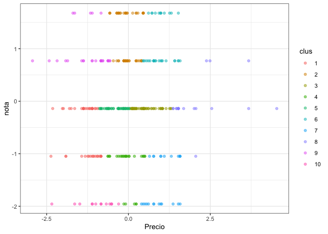
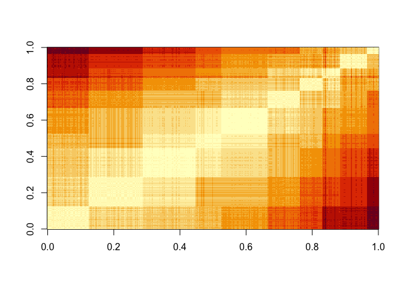

Actividad 5
================

## INICIO DE LAS BIBLIOTECAS

``` r
summary(sanguche)
```

    ##      url               Local            Direccion            Precio         
    ##  Length:410         Length:410         Length:410         Length:410        
    ##  Class :character   Class :character   Class :character   Class :character  
    ##  Mode  :character   Mode  :character   Mode  :character   Mode  :character  
    ##                                                                             
    ##                                                                             
    ##                                                                             
    ##                                                                             
    ##  Ingredientes            nota          texto          
    ##  Length:410         Min.   :1.000   Length:410        
    ##  Class :character   1st Qu.:3.000   Class :character  
    ##  Mode  :character   Median :3.000   Mode  :character  
    ##                     Mean   :3.167                     
    ##                     3rd Qu.:4.000                     
    ##                     Max.   :5.000                     
    ##                     NA's   :8

``` r
# eliminas las variables que vamos a trabajar
sanguche1 <- subset(sanguche, select = -c(texto, url, Local, Direccion, Ingredientes))
summary(sanguche1)
```

    ##     Precio               nota      
    ##  Length:410         Min.   :1.000  
    ##  Class :character   1st Qu.:3.000  
    ##  Mode  :character   Median :3.000  
    ##                     Mean   :3.167  
    ##                     3rd Qu.:4.000  
    ##                     Max.   :5.000  
    ##                     NA's   :8

\#\#pasar precio a numerico y sacar datos NA

``` r
sanguche1$Precio <- as.numeric(gsub('[$.]', '', sanguche1$Precio))
```

    ## Warning: NAs introduced by coercion

``` r
sanguche1.1 <- na.omit(sanguche1)
summary(sanguche1.1)
```

    ##      Precio           nota      
    ##  Min.   :  600   Min.   :1.000  
    ##  1st Qu.: 4892   1st Qu.:3.000  
    ##  Median : 5990   Median :3.000  
    ##  Mean   : 6061   Mean   :3.154  
    ##  3rd Qu.: 7100   3rd Qu.:4.000  
    ##  Max.   :14500   Max.   :5.000

\#\#escalar los datos para poder trabajar con ellos

``` r
sangu <- sanguche1.1 [, colnames(sanguche1.1) %in% c("Precio", "nota")]

escal_sangu = scale(sanguche1.1) %>% as_tibble()

escal_sangu %>% summary()
```

    ##      Precio              nota        
    ##  Min.   :-2.93234   Min.   :-1.9565  
    ##  1st Qu.:-0.62728   1st Qu.:-0.1396  
    ##  Median :-0.03792   Median :-0.1396  
    ##  Mean   : 0.00000   Mean   : 0.0000  
    ##  3rd Qu.: 0.55815   3rd Qu.: 0.7689  
    ##  Max.   : 4.53193   Max.   : 1.6774

``` r
modelo_kmeans <- kmeans(escal_sangu, centers = 10)
modelo_kmeans2 <- kmeans(sanguche1.1, centers = 10)

# creo la variable cluster en la tabla escal_data_pokda
escal_sangu$clus <- modelo_kmeans$cluster %>% as.factor()
sanguche1.1$clus <- modelo_kmeans2$cluster %>% as.factor()

ggplot(escal_sangu, aes(Precio, nota, color=clus)) +
  geom_point(alpha=0.5, show.legend = T) +
  theme_bw()
```

<!-- -->

``` r
ggplot(sanguche1.1, aes(Precio, nota, color=clus)) +
  geom_point(alpha=0.5, show.legend = T) +
  theme_bw()
```

<!-- -->

``` r
info_clus <- modelo_kmeans$centers
info_clus2 <- modelo_kmeans2$centers

info_clus
```

    ##         Precio        nota
    ## 1  -1.30070075 -0.52315192
    ## 2  -0.02088406  1.22315029
    ## 3   0.51895659 -0.13957109
    ## 4  -0.04693376 -1.21028074
    ## 5  -0.37988026 -0.13957109
    ## 6   0.95077037  1.08038900
    ## 7   1.01191144 -1.54014584
    ## 8   2.12618252 -0.04394152
    ## 9  -1.19135477  0.92554447
    ## 10 -0.99542880 -1.95653293

``` r
info_clus2
```

    ##       Precio     nota
    ## 1  12050.000 3.500000
    ## 2   4417.097 2.838710
    ## 3   5529.355 3.451613
    ## 4   6427.353 3.176471
    ## 5   4966.250 3.031250
    ## 6   7114.545 3.227273
    ## 7   3759.412 2.882353
    ## 8   2300.000 3.111111
    ## 9   8473.158 3.087719
    ## 10  5915.510 3.367347

## Evolución suma de cuadrados intra-cluster en la medida que aumentamos el numero de k

``` r
SSinterior <- numeric(30)

for(k in 1:30){
  modelo <- kmeans(escal_sangu, centers = k)
  SSinterior[k] <- modelo$tot.withinss
}

plot(SSinterior)
```

<!-- -->

## Inspeccion visual

``` r
escal_sangu$clus <- as.numeric(escal_sangu$clus)
sanguche1.1$clus <- as.numeric(sanguche1.1$clus)

# uso distancia euclidiana
tempDist <- dist(escal_sangu) %>% as.matrix()

#reordeno filas y columnas en base al cluster obtenido
index <- sort(modelo_kmeans$cluster, index.return=TRUE)

#reordeno filas y columnas en base al cluster obtenido
tempDist <- tempDist[index$ix,index$ix]
rownames(tempDist) <- c(1:nrow(escal_sangu))
colnames(tempDist) <- c(1:nrow(escal_sangu))

image(tempDist)
```

<!-- -->

``` r
library(factoextra)
```

    ## Welcome! Want to learn more? See two factoextra-related books at https://goo.gl/ve3WBa

``` r
#Calcula el hopkins statistic 
res <- get_clust_tendency(escal_sangu, n = 30, graph = FALSE)
res2 <- get_clust_tendency(sanguche1.1, n = 30, graph = FALSE)

print(res)
```

    ## $hopkins_stat
    ## [1] 0.9556037
    ## 
    ## $plot
    ## NULL

``` r
print(res2)
```

    ## $hopkins_stat
    ## [1] 0.9448769
    ## 
    ## $plot
    ## NULL

``` r
#Correlation
#construyo matriz de correlacion ideal (cada entidad correlaciona 1 con su cluster)
tempMatrix2 <- matrix(0, nrow = nrow(escal_sangu), ncol = nrow(escal_sangu))
tempMatrix2[which(index$x==1), which(index$x==1)]  <- 1
tempMatrix2[which(index$x==2), which(index$x==2)]  <- 1
tempMatrix2[which(index$x==3), which(index$x==3)]  <- 1
tempMatrix2[which(index$x==4), which(index$x==4)]  <- 1
tempMatrix2[which(index$x==5), which(index$x==5)]  <- 1
tempMatrix2[which(index$x==6), which(index$x==3)]  <- 1
tempMatrix2[which(index$x==7), which(index$x==4)]  <- 1
tempMatrix2[which(index$x==8), which(index$x==5)]  <- 1
tempMatrix2[which(index$x==9), which(index$x==3)]  <- 1
tempMatrix2[which(index$x==10), which(index$x==4)]  <- 1


#construyo matriz de disimilitud
tempDist_2 <- 1/(1+tempMatrix2)

#Calcula correlacion 
cor2 <- cor(tempMatrix2[upper.tri(tempMatrix2)],tempDist_2[upper.tri(tempDist_2)])

print(cor2)
```

    ## [1] -1

## Indice de cohesión y el de separación.

``` r
library(flexclust)
```

    ## Loading required package: grid

    ## Loading required package: lattice

    ## Loading required package: modeltools

    ## Loading required package: stats4

``` r
withinCluster <- numeric(10)
for (i in 1:10){
  tempdata <- escal_sangu[which(modelo_kmeans$cluster == i),]
  withinCluster[i] <- sum(dist2(tempdata,colMeans(tempdata))^2)
}
cohesion = sum(withinCluster)
#es equivalente a model$tot.withinss en k-means
print(c(cohesion, modelo_kmeans$tot.withinss))
```

    ## [1] 104.4527 104.4527

## Coeficiente de silueta

``` r
library(cluster)

coefSil <- silhouette(modelo_kmeans$cluster,dist(escal_sangu))
summary(coefSil)
```

    ## Silhouette of 358 units in 10 clusters from silhouette.default(x = modelo_kmeans$cluster, dist = dist(escal_sangu)) :
    ##  Cluster sizes and average silhouette widths:
    ##        45        58        57        28        50        35        24        19 
    ## 0.7061747 0.6261672 0.7609831 0.6209413 0.7937084 0.6801746 0.6472843 0.5160647 
    ##        29        13 
    ## 0.7452566 0.8031796 
    ## Individual silhouette widths:
    ##    Min. 1st Qu.  Median    Mean 3rd Qu.    Max. 
    ##  0.1652  0.6308  0.7103  0.6976  0.7700  0.8597
